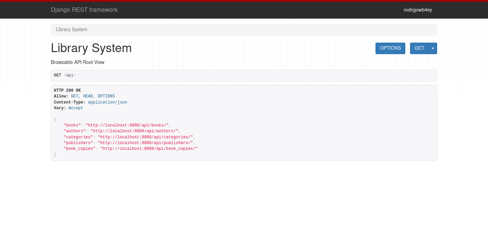
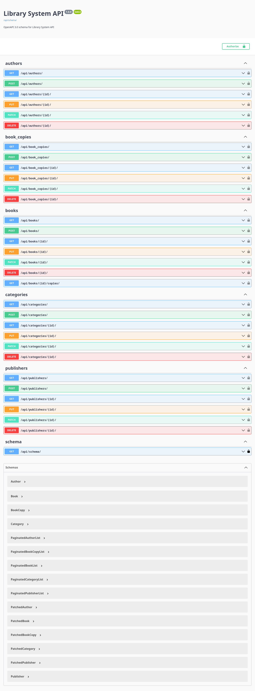

# Library System API

## Table of contents

- [Overview](#overview)
    - [Screenshots](#screenshots)
- [Built With](#built-with)
- [Project Setup](#project-setup)
- [Author](#author)

## Overview

### Screenshots

'/api/'



'/api/schema/swagger-ui/'



### Built with

- [Django](https://www.djangoproject.com/)
- [Django REST Framework](https://www.django-rest-framework.org/)
- [PostgreSQL](https://www.postgresql.org/)
- [Docker](https://www.docker.com/)

## Project Setup for Development

```sh
docker compose build
docker compose up
```

## Author

- Rodrigo Bezerra Saraiva